# Hey, I'm Sunrit

I'm a backend and machine learning engineer, spending too much time in front of the computer.

When i'm not building, you'd find me reading books, studying maths, or napping.

<details open>
  <summary>👀 Currently listening</summary>

  [](https://spotify-github-profile.kittinanx.com/api/view?uid=qy9jhr85so9g8pr6zz7aizc6x&redirect=true)
</details>

<details>
  <summary>🌊 Say hi!</summary>

  - Personal site: [https://sunritjana.vercel.app](https://sunritjana.vercel.app)
  - Twitter: [@janaSunrise](https://twitter.com/janaSunrise)
  - Discord: [@sunritjana](https://discord.com/users/sunritjana)
</details>

<details>
  <summary>📊 Github Stats</summary>
 
  <p>
    
  </p>
</details>

<details>
  <summary>🛠 Wakatime metrics</summary>
  <br />

<!--START_SECTION:waka-->


**🐱 My GitHub Data** 

> 📦 499.4 kB Used in GitHub's Storage 
 > 
> 🏆 457 Contributions in the Year 2026
 > 
> 🚫 Not Opted to Hire
 > 
> 📜 74 Public Repositories 
 > 
> 🔑 3 Private Repositories 
 > 
**I'm a Night 🦉** 

```text
🌞 Morning                4022 commits        ████░░░░░░░░░░░░░░░░░░░░░   14.80 % 
🌆 Daytime                9012 commits        ████████░░░░░░░░░░░░░░░░░   33.17 % 
🌃 Evening                11867 commits       ███████████░░░░░░░░░░░░░░   43.68 % 
🌙 Night                  2268 commits        ██░░░░░░░░░░░░░░░░░░░░░░░   08.35 % 
```
📅 **I'm Most Productive on Thursday** 

```text
Monday                   3661 commits        ███░░░░░░░░░░░░░░░░░░░░░░   13.47 % 
Tuesday                  4100 commits        ████░░░░░░░░░░░░░░░░░░░░░   15.09 % 
Wednesday                3786 commits        ███░░░░░░░░░░░░░░░░░░░░░░   13.93 % 
Thursday                 4405 commits        ████░░░░░░░░░░░░░░░░░░░░░   16.21 % 
Friday                   3841 commits        ████░░░░░░░░░░░░░░░░░░░░░   14.14 % 
Saturday                 4230 commits        ████░░░░░░░░░░░░░░░░░░░░░   15.57 % 
Sunday                   3146 commits        ███░░░░░░░░░░░░░░░░░░░░░░   11.58 % 
```


📊 **This Week I Spent My Time On** 

```text
🕑︎ Time Zone: Asia/Kolkata

💬 Programming Languages: 
TypeScript               3 hrs 21 mins       ██████████████████████░░░   86.15 % 
JSON                     21 mins             ██░░░░░░░░░░░░░░░░░░░░░░░   09.15 % 
Other                    4 mins              ░░░░░░░░░░░░░░░░░░░░░░░░░   01.80 % 
Markdown                 3 mins              ░░░░░░░░░░░░░░░░░░░░░░░░░   01.70 % 
Bash                     1 min               ░░░░░░░░░░░░░░░░░░░░░░░░░   00.70 % 

🔥 Editors: 
VS Code                  3 hrs 36 mins       ███████████████████████░░   92.66 % 
Unknown Editor           17 mins             ██░░░░░░░░░░░░░░░░░░░░░░░   07.34 % 

🐱‍💻 Projects: 
Dashboard                3 hrs 53 mins       █████████████████████████   100.00 % 

💻 Operating System: 
Mac                      3 hrs 53 mins       █████████████████████████   100.00 % 
```

**I Mostly Code in Python** 

```text
Python                   55 repos            █████████░░░░░░░░░░░░░░░░   35.26 % 
TypeScript               48 repos            ████████░░░░░░░░░░░░░░░░░   30.77 % 
Rust                     6 repos             █░░░░░░░░░░░░░░░░░░░░░░░░   03.85 % 
HTML                     4 repos             █░░░░░░░░░░░░░░░░░░░░░░░░   02.56 % 
Dart                     1 repo              ░░░░░░░░░░░░░░░░░░░░░░░░░   00.64 % 
```


**Timeline**


 Last Updated on 26/04/2026 02:02:16 UTC
<!--END_SECTION:waka-->
</details>

<details>
 <summary>✨ Detailed metrics</summary>
 
 <table>
  <tr>
    <th>🤗 Profile Details</th>
    <th>🔧 Repositories traffic</th>
  </tr>
  <tr>
   <td>
     
   </td>
   <td>
     
   </td>
  </tr>
  <tr>
    <th>📅 Isometric commit calendar</th>
    <th>👀 Most used languages</th>
  </tr>
  <tr>
    <td align="center">
      
    </td>
    <td>
      
    </td>
  </tr>
  <tr>
   <th>🌊 WakaTime plugin</th>
   <th>🌟 Recently starred repositories</th>
  </tr>
  <tr>
   <td align="center">
    
   </td>
   <td align="center">
    
   </td>
  </tr>
 </table>
</details>
